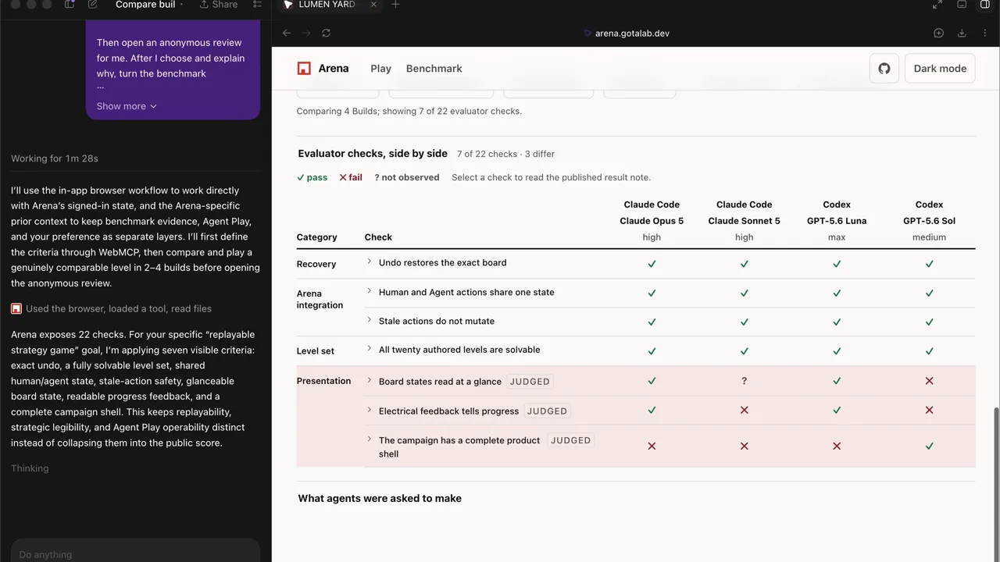
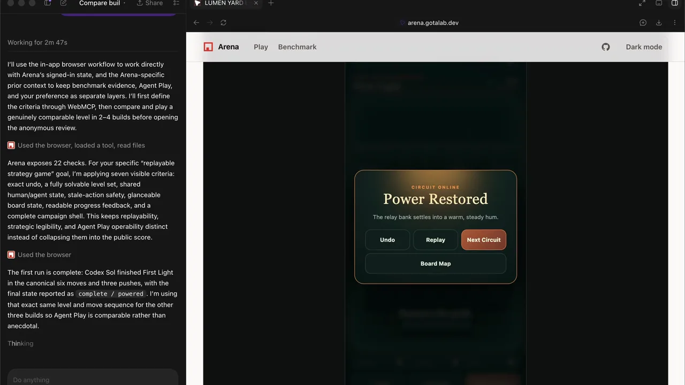
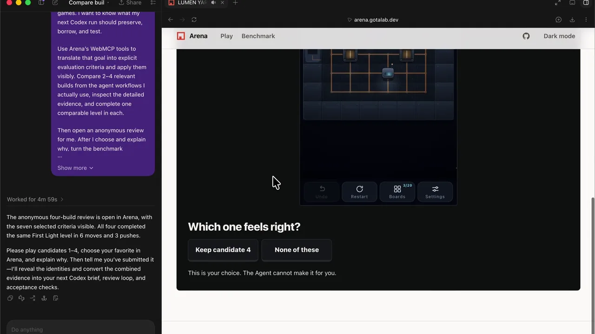
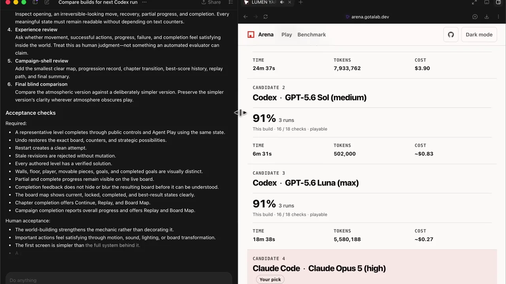

# Playable Arena

Playable Arena turns a fixed coding-agent benchmark into a shared improvement
loop. Multiple coding-agent configurations receive the same game brief. Arena
publishes their scores, detailed check results, and the playable games they
actually shipped.

A leaderboard shows who won the fixed test. It cannot decide which strengths
matter for the game you are about to build, and a score cannot establish how a
game feels to play. With WebMCP, a reviewer agent can work inside the same Arena
page as the person: read the relevant evidence, update the visible comparison,
open and play the real builds under comparable conditions, and prepare a 2–4
Build anonymous review. The person then plays the same shortlist and makes the
subjective choice in the UI; only then does Arena reveal identities and
published scores. The reviewer turns the combined evidence into concrete review
stages and acceptance checks for the next coding-agent run, while the published
benchmark itself remains fixed.

**[Open Playable Arena](https://arena.gotalab.dev)**

| 1. Read the relevant evidence | 2. Agent plays the live Builds |
| --- | --- |
| [](./docs/images/read-evidence.webp) | [](./docs/images/agent-play.webp) |
| **3. Human chooses blind** | **4. Improve the next agent run** |
| [](./docs/images/human-choice.webp) | [](./docs/images/next-run.webp) |

## Judge quick start

No Arena account or credentials are required. In ChatGPT's in-app browser,
there is no MCP server URL to add and no manual connection step: open the live
site and Arena registers the tools for the current page. In Google Chrome 149+
you can instead enable `chrome://flags/#enable-webmcp-testing` and restart the
browser. These are the two testing paths specified by the
[WebMCP Challenge rules](https://webmcp.devpost.com/rules).

Then try this prompt:

> Using this benchmark, what should I pay extra attention to when using Codex
> to build a replayable strategy game? Read the detailed checks, play the
> relevant candidates, and prepare an anonymous review. Do not choose for me.

A complete run should visibly move between the Benchmark, detailed checks, and
the playable Builds. The reviewer agent should complete the same comparable
level in each selected Build before opening the anonymous review. Then play the
candidates yourself and choose in the UI. The reviewer can prepare the evidence
and read the result, but it cannot make the human choice or reveal identities
early.

## Why WebMCP

The challenge asks every submission to answer four questions. For Arena:

- **Why this is a strong fit:** a benchmark contains more detailed checks than
  most people can compare by hand, while its playable outputs also have
  qualities such as clarity, feedback, and feel that the aggregate score cannot
  settle for a particular use case.
- **How it improves the experience:** the reviewer agent reads and filters the
  evidence, opens the actual Builds, and plays them while the person watches the
  same Arena UI update. Analysis and product state do not disappear into a
  detached API response.
- **What people and agents can do together:** the agent handles breadth,
  interpretation, and repeatable live checks across the shortlist. The person
  then plays the same candidates blind and makes the subjective choice. The
  reviewer uses all three evidence layers to produce review stages and
  acceptance checks for the person's next agent run. Neither side substitutes
  for the other, and Arena does not claim one configuration is universally best.
- **How it is implemented:** each route registers only its current tools through
  WebMCP. A trusted `arena.game.v1` handshake exposes game actions only for a
  compatible active Build, and the anonymous review exposes no tool that can
  choose or reveal on the person's behalf.

<details>
<summary><strong>WebMCP tool scope, example prompts, and source files</strong></summary>

### More WebMCP examples

Once the page tools are available, you can also ask:

- “What tasks are available, and which ones offer Agent Play?”
- “Filter the Benchmark to GPT-5.6 Sol.”
- “Show only the failed checks and explain the published evidence.”

The tools follow the page you are on:

- Home and Play expose `search_tasks` and `open_task`.
- Benchmark adds `filter_benchmark_results` and `open_build`.
- A named task adds `compare_task_builds` and `open_build`.
- A named task can open an Agent-selected anonymous review after exactly 2–4
  playable Builds are selected.
- Blind comparison hides builder identity until reveal.
- Selected review exposes `get_selected_review` and
  `open_review_candidate`; it never exposes a tool that makes the human choice.
  After the person chooses in the UI, `get_selected_review_result` becomes
  available with the review criteria, revealed identities and scores.
- Game controls appear only after the active frame completes the trusted
  `arena.game.v1` handshake.

The WebMCP implementation starts in
[`src/platform/model-context.ts`](./src/platform/model-context.ts), which
resolves ChatGPT's `document.modelContext` or Chrome's
`navigator.modelContext`. Route-scoped registration lives in
[`src/hooks/useArenaWebMcpTools.ts`](./src/hooks/useArenaWebMcpTools.ts),
anonymous shortlist review in
[`src/hooks/useSelectedReviewWebMcpTools.ts`](./src/hooks/useSelectedReviewWebMcpTools.ts),
and live game operation in
[`src/hooks/useWebMcpGameTools.ts`](./src/hooks/useWebMcpGameTools.ts). Tool
hooks call `modelContext.registerTool(...)` and abort stale registrations when
the route or identity state changes. Inputs, outputs, navigation, stale-state
rejection, and reveal boundaries are covered by the repository tests.

Agent Play support is reported honestly at two levels. A task is either
`supported` or `human_only`; each build separately reports whether its Agent
Play contract passed, failed, was not evaluated, or did not apply.

</details>

## How Arena works

```text
one game brief
      ↓
multiple coding-agent configurations
      ↓
playable builds + evaluation evidence
      ↓
benchmark exploration, Agent-selected review, blind comparison, and WebMCP tools
```

The published games run inside opaque-origin frames with
`sandbox="allow-scripts"`. Arena owns the surrounding interface and WebMCP tool
descriptions, while a session-bound channel carries validated game commands to
the active frame.

### Production on Cloudflare

The public app runs on Cloudflare Workers. The Main Worker serves the Arena UI
and session-bound APIs, while Cloudflare D1 stores anonymous blind-review
choices. A separate Artifact Worker serves the content-addressed generated
games from `artifacts.arena.gotalab.dev`, keeping untrusted game code outside
the trusted Arena origin. Wrangler powers the same two-Worker and D1 topology
for local development and smoke testing.

## Run it locally

Install the exact reviewed dependency set without lifecycle scripts:

```bash
corepack enable
corepack prepare pnpm@10.20.0 --activate
pnpm install --frozen-lockfile --ignore-scripts
pnpm test
pnpm run typecheck
pnpm run build
```

Start the complete runtime, including the Main and Artifact origins and a fresh
local D1 database:

```bash
pnpm run dev:runtime
```

Open `http://127.0.0.1:8787`. Artifact content runs separately on port 8788.
The command loads the sanitized public fixture, creates fresh local secrets,
and removes its temporary state when it stops. It needs no Cloudflare account
or production credentials.

Run the bounded HTTP, D1, and lifecycle smoke with:

```bash
pnpm run dev:runtime --smoke
```

For UI-only work, a static preview is also available:

```bash
pnpm run dev --host 0.0.0.0
```

## Build the runtime

From a clean committed checkout:

```bash
pnpm run build:product-runtime --output /tmp/arena-product-runtime
```

The output contains the Main and Artifact Worker bundles, Web assets, the
content-addressed WebMCP probe, a runtime input manifest, and a build receipt.
The build verifies the public data and every published Artifact before it
produces the runtime.

## What's in this repository

- `src/`: the Arena interface and route-scoped WebMCP tools
- `runtime/`: Main and Artifact Workers plus the minimal runtime D1 schema
- `public-release/accepted/`: the sanitized, content-addressed public release
- `public-contract/`: the public bundle, Agent Play, and build receipt contracts
- `test/`: product, runtime, WebMCP, privacy, and release-boundary tests

This repository contains everything needed to run the published Arena
experience. Task authoring, private rubrics, raw evaluation runs, credentials,
and production release records are not part of the public product.

## Project history

Arena existed before the WebMCP Challenge. The work added for the challenge and
the pre-existing product boundary are described in [HACKATHON.md](./HACKATHON.md).

## License

Arena-owned source and assets are available under the [MIT License](./LICENSE).
Official vendor marks and other third-party materials remain under their
owners' terms; see [Third-party notices](./THIRD_PARTY_NOTICES.md) and the
[public license manifest](./public-license-manifest.v1.json).
